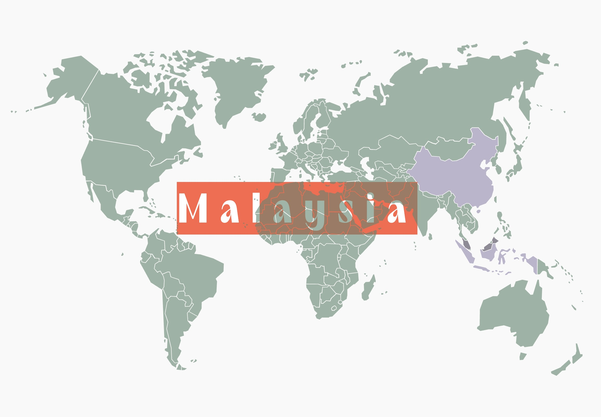

<!---
tanvihang/tanvihang is a ✨ special ✨ repository because its `README.md` (this file) appears on your GitHub profile.
You can click the Preview link to take a look at your changes.
--->

 

 
  <samp>
     
     Hi i'm Angus Tan, <b>creative web & app dev</b> based in Malaysia 🇲🇾.
     
     
    
     
     
        
        &nbsp;
        
     
     
    
  </samp>

 

